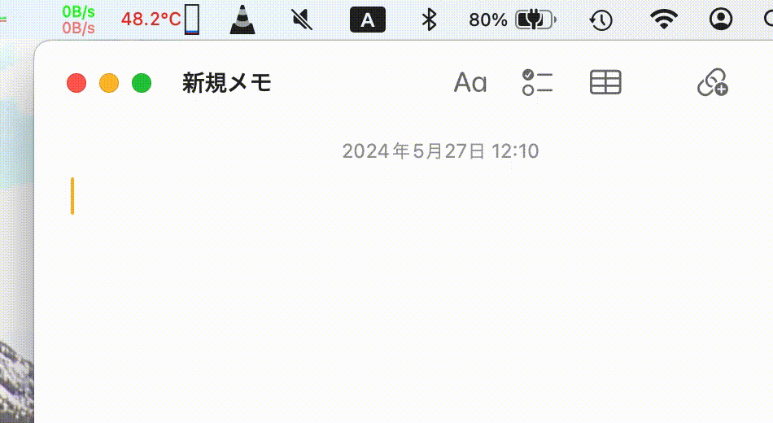

# MacTcode

## デモ



## 動機

macOS用のT-Codeが使えるIMとして[MacUIM](https://github.com/e-kato/macuim)を使っていましたが、永らく更新されていません。
ソースコードは公開されているものの、自分でビルドするのは成功していません。saryとかの用意が難しく…(Ruby 1.9.3をSonomaに入れるとか難しい)。

そこで、単純なT-Codeだけのドライバなら作っちゃえばいいんじゃね? ということで始めました。

## 実装したい機能

おおむね優先度順
- [x] 基本文字の入力
- [x] postfix部首変換
- [x] postfix交ぜ書き変換
    - [x] 変換候補選択画面
    - [x] 送りがなサポート
- [x] 全角入力モード (v0.1.4.1)
- [x] 配布パッケージ、notarization
- [x] configファイルサポート
- [ ] パスワード入力時はパススルーする
- [ ] メニュー(config再読み込みとかテンプレ生成とか)
- [ ] 1行入力(T-Code変換をしつつバッファにため、一気に入力するモード)
- [ ] 3ストローク以上の基本文字サポート
- [ ] 仮想鍵盤

## 現状についての警告

- デバッグビルドでは、NSLogに全ストロークが出力されます。プライバシー注意!

## インストール

- GitHubのリリースタグにdmgがある場合は、開いて以下を実施してください
    - `sudo cp -r MacTcode.app /Library/Input\ Methods/`
        - アップデートの場合はまず消してから
    - dmgがない場合はごめんなさい
- ログアウトしてログインし直すと、入力ソースとして選択できるようになります
- 一部アプリに対して部首交換、交ぜ書き変換する場合、バックスペースを送るためにアクセシビリティ機能を使っています
    - システム設定 → プライバシーとセキュリティー → アクセシビリティ でMacTcodeに制御を許可してください

## 設定ファイル

MacTcodeは設定ファイルを使用してカスタマイズできます。

### 設定ファイルの場所

設定ファイルは以下の場所に配置してください：
```
~/Library/Containers/jp.mad-p.inputmethod.MacTcode/Data/Library/Application Support/MacTcode/config.json
```

MacTcodeを一度起動するとディレクトリが作られます。

### 設定ファイルの構造

設定ファイルはJSON形式で、以下の5つのカテゴリーに分かれています：

- **mazegaki**: 交ぜ書き変換の設定
- **bushu**: 部首変換の設定
- **keyBindings**: キーバインドの設定
- **ui**: ユーザーインターフェースの設定
- **system**: システム動作の設定

### サンプル設定ファイル

プロジェクトルートの`sample-config.json`ファイルに完全なサンプル設定があります。このファイルをコピーして使用してください：

```bash
cp sample-config.json ~/Library/Containers/jp.mad-p.inputmethod.MacTcode/Data/Library/Application Support/MacTcode/config.json
```

MacTcodeを一度起動するとコピー先ディレクトリが作られます。

### 主な設定項目

- **T-Code基本文字表**: 40x40の文字マッピングテーブル
- **候補選択キー**: 変換候補を選択するためのキー設定
- **除外アプリ**: T-Code変換を無効化するアプリケーション
- **辞書ファイルパス**: 部首変換辞書のファイルパス
- **ログ出力**: デバッグログの有効/無効
- **バックスペース動作**: 変換時のバックスペース設定

## 参考文献

- https://github.com/ensan-hcl/azooKey-Desktop
- https://github.com/google/mozc/
- [azooKey on macOSの開発知見](https://zenn.dev/azookey/articles/d06b4ee8039ba9)
- [日本語入力を作るときに必要だった本](https://mzp.booth.pm/items/809262)
- [Typut](https://github.com/ensan-hcl/Typut)

## ライセンス

MIT
